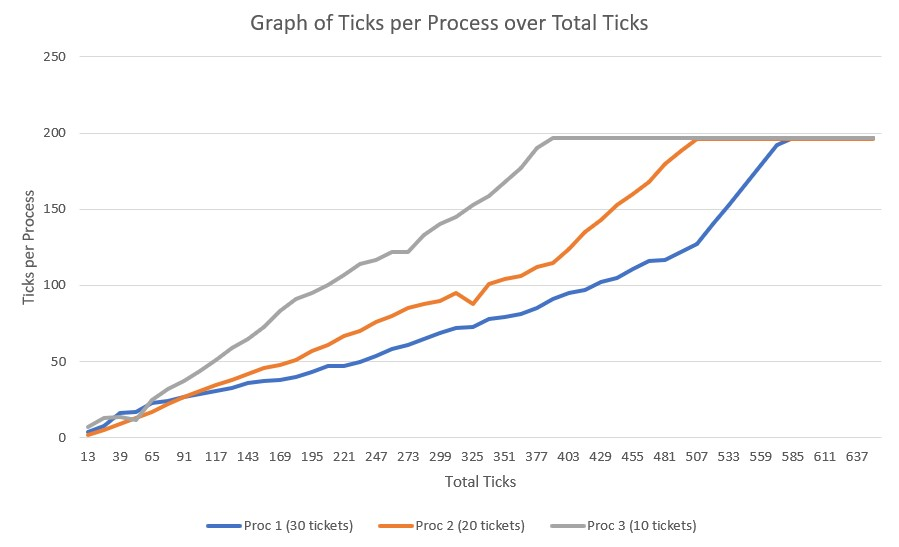

# CS372 PROJECT 5: An xv6 Lottery Scheduler

## System Calls

Both system calls, `int settickets(int number)` and `int getpinfo(struct pstat *)`, are implemented at the end of `proc.c`.

### Command line program: `ps`

Implementation of user program `ps` is in `ps.c`.

## Lottery Scheduler

The majority of changes were made in `proc.c` to implement a lottery scheduler for xv6:

* In function `allocproc(void)`, line 94:

  > `p->tickets = 1`;

  This ensures that by default each process gets one ticket.

* In function `fork(void)`, line 206 - 209:

  > // child inherits same number of tickets as parent
  > np->tickets = curproc->tickets;
  > // reset ticks
  > np->ticks = 0;

  Child process created using `fork()` inherits the same number of tickets as parent process.

* In function `scheduler(void)`, stating at line 331, is where the majority of changes are made to implement lottery scheduler. Please refer to the comments made in the code to see changes.

### Graph

Type `graph` into xv6 shell to obtain data used to create the graph above. The user program `graph` is implemented in `graph.c`. The graph above shows number of ticks that each process accumates over time (in ticks). Process 1 has 30 tickets, process 2 20, and process 3 10. The system call `settickets(int number)` was used to set the tickets for each of the three processes and `getpinfo(struct pstat *)` was called by the parent process every 13 ticks to gather information about all running processes.
